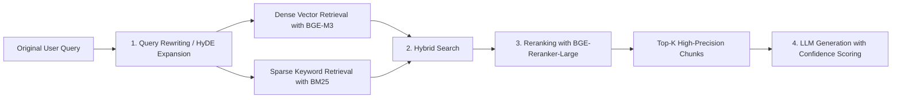

# Case 1: Intelligent Customer Service and Enterprise Private Knowledge Base System — User Guide

> **Module Overview**：An enterprise-grade RAG (Retrieval-Augmented Generation) private knowledge base QA system built with **modern LCEL chain architecture + local vector retrieval (FAISS) + BGE-M3 semantic embeddings + a Streamlit interactive frontend**.

---

## 📖 Table of Contents
1. [Overall System Architecture and Design Principles](#1-overall-system-architecture-and-design-principles)
2. [Project File Structure Overview](#2-project-file-structure-overview)
3. [Core Modules and Code Locations](#3-core-modules-and-code-locations)
   - [3.1 RAG Engine Core — rag_engine_en.py](#31-rag-engine-core--rag_engine_enpy)
   - [3.2 Web Interactive Frontend — app_en.py](#32-web-interactive-frontend--apppy)
   - [3.3 Model Connection Factory — app_en.py get_llm()](#33-model-connection-factory--apppy-get_llm)
   - [3.4 Launcher — start_rag_knowledge_base_en.bat](#34-launcher--start_rag_knowledge_base_enbat)
4. [Quick Start and Run Instructions](#4-quick-start-and-run-instructions)
5. [Core Parameters and Tuning Guide](#5-core-parameters-and-tuning-guide)
6. [In-Depth Comparison: Modern LCEL vs. Legacy RetrievalQA](#6-in-depth-comparison-modern-lcel-vs-legacy-retrievalqa)
7. [Enterprise Production Extensions and Evolution](#7-enterprise-production-extensions-and-evolution)
8. [Frequently Asked Questions (FAQ)](#8-frequently-asked-questions-faq)

---

## 1. Overall System Architecture and Design Principles

This case follows an industry-grade RAG architecture and addresses three major challenges of deploying general-purpose LLMs in enterprises:
1. **Knowledge freshness limitations** (training data cutoff dates);
2. **Gaps in private-domain knowledge** (internal policies, technical manuals, and confidential contracts);
3. **Model hallucinations** (responses without authoritative factual support).

### 📐 Architecture and Data Flow
```text
[ Enterprise Private PDFs / Documents ]
       │
       ▼ (1. Text extraction and cleaning: pypdf)        ← rag_engine.py pdf_read() line 100
[ Raw Long-Form Text ]
       │
       ▼ (2. Semantic recursive chunking)                 ← rag_engine.py get_chunks() line 125
[ Document Chunks ]                 ← chunk_size=800, chunk_overlap=100
       │
       ▼ (3. Semantic embedding: BAAI/bge-m3)      ← rag_engine.py get_embeddings() line 143
[ FAISS Vector Database (persisted to local disk) ]       ← rag_engine.py create_vector_store() line 178
       │
═══════╪═════════════════════════════════════════════════════════════════
       ▼ User Query
[ Natural-Language User Query ] ──► [ Query Embedding (BGE-M3) ]
                                      │
                                      ▼ (4. Cosine-similarity retrieval, Top-K=4)  ← app_en.py line 241
                               [ Retrieved Relevant Context ]
                                      │
                                      ▼ (5. LCEL Prompt Assembly)       ← app_en.py line 249
                               [ Prompt Template (Context + Query) ]
                                      │
                                      ▼ (6. LLM Inference and Generation)            ← app_en.py get_llm() line 106
                       [ SiliconFlow Qwen3-8B / Local Ollama / Mock ]
                                      │
                                      ▼ (7. Typewriter-Style Streaming Output)          ← app_en.py line 252
                          [ Streamlit Web Response + Source Trace Cards ]
```

---

## 2. Project File Structure Overview

```
case1_rag_knowledge_base/
├── USER_GUIDE.md                          ← This file
├── start_rag_knowledge_base_en.bat  ← Windows double-click launcher
├── app_en.py                               ← Streamlit Web frontend (main entry point)
├── rag_engine_en.py                     ← RAG core engine (PDF parsing / embedding / retrieval)
├── requirements.txt                     ← Case 1 dependency list
├── faiss_db/                            ← Auto-generated vector index directory (created after document upload)
│   ├── index.faiss
│   └── index.pkl
└── sample_docs/                         ← Sample PDF documents for testing
    └── enterprise_rag_guide.pdf
```

---

## 3. Core Modules and Code Locations

### 3.1 RAG Engine Core — `rag_engine_en.py`

| Function / Class | Line | Description |
|:---|:---:|:---|
| `pdf_read(pdf_docs)` | **line 100** | Uses `pypdf` or `PyPDF2` to extract plain text from every PDF page. Empty files or scanned documents trigger a clear warning. |
| `get_chunks(text, chunk_size, chunk_overlap)` | **line 125** | Recursive character splitter that prioritizes paragraph (`\n\n`) and sentence boundaries, with an 800/100-character default. A pure-Python fallback is provided for teaching. |
| `get_embeddings(model_name)` | **line 143** | Embedding model loading: prefers the free cloud-based SiliconFlow `BAAI/bge-m3` API, with local Hugging Face offline loading as a fallback. |
| `create_vector_store(text_chunks, embeddings, save_path)` | **line 178** | Converts text chunks into vectors, stores them in a FAISS index, and persists the index under `faiss_db/`. |
| `load_vector_store(load_path, embeddings)` | **line 195** | Loads the existing FAISS vector store from local disk without re-embedding the documents. |
| `build_rag_chain(retriever, llm)` | **line 234** | Builds a declarative LCEL chain: `context` + `question` → Prompt → LLM → string output. |
| `format_docs(docs)` | **line 225** | Helper function that formats retrieved documents as numbered text chunks. |
| `RAG_PROMPT_TEMPLATE` | **line 213** | Global prompt constant that requires the LLM to answer strictly from known information and avoid fabrication. |
| Environment variable loading | **lines 22–35** | Multi-level `.env` search: `DOTENV_PATH` → same-level `.env` → `runtime/.env` → parent-level `.env` |

**Key design details**:
- `pdf_read` line 116: Checks for empty extracted text and raises `ValueError` for scanned PDFs instead of crashing.
- `get_chunks` line 134: Chinese punctuation is used as delimiters to preserve chunk semantics.
- `get_embeddings` lines 150–160: Prefers the cloud API and automatically falls back to the local model on failure.
- `create_vector_store` line 190: `FAISS.from_texts` performs embedding and index construction in one step.
- `build_rag_chain` lines 238–246: LCEL pipeline that natively supports `stream()` for streaming output.

### 3.2 Web Interactive Frontend — `app_en.py`

| Functional Area | Line | Description |
|:---|:---:|:---|
| Environment variable loading (multi-level search) | **lines 23–36** | Same multi-level `.env` search logic as `rag_engine_en.py`. |
| Page configuration and styling | **lines 57–73** | Streamlit wide-layout page and title styling. |
| State management and initialization | **lines 79–94** | Checks whether `faiss_db/` exists and initializes the `db_ready` and `messages` session states. |
| `is_valid_db(path)` | **line 82** | Strictly validates FAISS index integrity (`index.faiss` and `index.pkl` must both exist). |
| `load_cached_embeddings()` | **line 100** | `@st.cache_resource` Caches the BGE-M3 embedding model to avoid repeated loading. |
| `get_llm()` | **line 106** | Obtains an LLM instance using a three-level fallback strategy (see Section 3.3). |
| Sidebar: document management | **lines 147–204** | PDF upload, processing, and knowledge-base clearing buttons. |
| Dynamic status badge | **lines 151–155** | Uses `st.empty()` to refresh the "Not built / Ready" status immediately. |
| Submit and process flow | **lines 174–193** | Full pipeline: upload → `pdf_read` → `get_chunks` → `create_vector_store`. |
| Clear knowledge base | **lines 196–203** | Deletes the `faiss_db/` directory, clears message history, and calls `st.rerun()` automatically. |
| Main QA interface | **lines 210–273** | Renders chat messages, receives user input, and performs RAG retrieval with streaming output. |
| Retrieval and streaming response | **lines 238–255** | Loads the vector store → retrieves Top-K=4 → formats the context → uses `st.write_stream()` for a typewriter effect. |
| Source trace card | **lines 258–262** | Displays retrieved source document chunks in a collapsible panel for traceable answers. |

### 3.3 Model Connection Factory — `app_en.py` `get_llm()` line 106

Three-level fallback strategy to keep the application operational across environments:

```text
get_llm() line 106
  │
  ├─ line 114: SILICONFLOW_API_KEY Present?
  │    └─ ✅ Yes → ChatOpenAI(Qwen/Qwen3-8B, streaming=True, enable_thinking=False)
  │              └─ line 123: extra_body={"enable_thinking": False} Disables the reasoning chain for faster responses
  │
  └─ line 129: Try local Ollama
       ├─ line 131: langchain_ollama.ChatOllama(deepseek-r1:1.5b)
       └─ line 135: Fallback to langchain_community.chat_models.ChatOllama
            └─ line 138: FakeListLLM fallback (teaching/demo mode)
```

**Model Parameter Details**（`app_en.py` lines 117–124）：
- `model`：`Qwen/Qwen3-8B`（Read from `ONLINE_LLM_MODEL` in `.env`）
- `openai_api_base`：`https://api.siliconflow.cn/v1`（Read from `SILICONFLOW_BASE_URL` in `.env`）
- `temperature=0.1`：A low temperature is recommended for RAG scenarios to reduce hallucinations
- `streaming=True`：Enables streaming for the typewriter effect
- `extra_body={"enable_thinking": False}`：Disables Qwen3 reasoning, reducing latency from ~72s to ~1.8s

### 3.4 Launcher — `start_rag_knowledge_base_en.bat`

| Code Section | Line | Description                                                       |
|:---|:---:|:------------------------------------------------------------------|
| Title setting | line 2 | The `title` command sets the console window title.                |
| Change directory | line 3 | `cd /d "%~dp0"` Changes to the directory containing the BAT file. |
| Portable interpreter detection | lines 5–8 | Checks whether `../runtime/Scripts/python.exe` exists.            |
| Environment variable injection | line 13 | Sets `DOTENV_PATH` to `runtime/.env`.                             |
| Model information display | line 21 | Prints `Qwen/Qwen3-8B` model information to the console.          |
| Launch command | line 28 | `python -m streamlit run app_en.py` Starts the Web service        |

---

## 4. Quick Start and Run Instructions

### 1. Environment Preparation
Make sure the portable Python environment under `runtime/` is available (approximately 1.4 GB including all dependencies).

### 2. Start the Service
- **Method 1 (double-click)**：In the `case1_rag_knowledge_base/` directory, double-click `start_rag_knowledge_base_en.bat`.
- **Method 2 (command line)**：
  ```bash
  cd case1_rag_knowledge_base
  ..\runtime\Scripts\python.exe -m streamlit run app_en.py
  ```
  After a successful launch, the browser will automatically open `http://localhost:8501`.

### 3. Usage Flow
1. Click **"Upload Internal PDF Documents"** in the left sidebar and select `sample_docs/enterprise_rag_guide.pdf` (or your own enterprise documents).
2. Click **"🚀 Submit and Process"**. The system automatically chunks the text and builds the vector index; the sidebar status changes to **"✅ Knowledge Base Status: Ready"**.
3. Enter a question in the chat box at the bottom of the main interface (for example: "*What are the core advantages of deploying an LLM locally?*").
4. Review the streamed professional response on the right, and expand **"🔍 View Reference Sources and Evidence"** below it to verify the original document text.

---

## 5. Core Parameters and Tuning Guide

| Parameter | Location                 | Default | Tuning Recommendations and Use Cases |
| :--- |:-------------------------| :--- | :--- |
| `chunk_size` | `rag_engine.py` line 126 | `800` | For legal or contract clauses, reduce to `500`; for long narrative documents, increase to `1200` |
| `chunk_overlap` | `rag_engine.py` line 127 | `100` | Usually set to 10%–15% of `chunk_size` |
| `k (Top-K)` | `app_en.py` line 241     | `4` | Increase to `6~8` when retrieval is insufficient; reduce to `3` to lower token usage |
| `temperature` | `app_en.py` line 121     | `0.1` | A low temperature (`0.0~0.2`) is recommended for RAG to reduce hallucinations |
| `model_name` (Embedding) | `rag_engine.py` line 143 | `BAAI/bge-m3` | For maximum speed, replace it with `BAAI/bge-small-zh-v1.5` |
| `ONLINE_LLM_MODEL` | `runtime/.env`           | `Qwen/Qwen3-8B` | Can be replaced with other free models supported by SiliconFlow |
| `SILICONFLOW_BASE_URL` | `runtime/.env`           | `https://api.siliconflow.cn/v1` | Change this URL when switching API providers |

---

## 6. In-Depth Comparison: Modern LCEL vs. Legacy RetrievalQA

| Comparison Dimension | Legacy `RetrievalQA` (deprecated / maintenance mode) | Modern LCEL Chain Architecture (used in this project)                                          |
| :--- | :--- |:-----------------------------------------------------------------------------------------------|
| **Code Transparency** | Black-box encapsulation; intermediate data flow is difficult to monitor or intercept | White-box transparency; Logger / Hook components can be inserted at any input/output node      |
| **Streaming Typewriter Support** | Requires intrusive custom CallbackHandler code | Native first-class support; call `.stream()` directly to obtain an iterator                    |
| **Asynchrony and Concurrency** | Asynchronous support is cumbersome and concurrent tasks can block easily | Native support for `astream()` and `abatch()`; high-concurrency throughput can improve by 3–5× |
| **Prompt and Structural Flexibility** | Restricted to fixed fields; modifying the prompt structure is awkward | Flexible composition of dictionaries, multimodal inputs, and multiple custom retrievers        |
| **Type Safety and Debugging** | Deep error stacks make syntax and parameter errors difficult to locate | Strong type contracts clearly show which Runnable layer raised the exception                   |
| **Code Location** | — | LCEL chain in `rag_engine_en.py`, lines 234–246                                                |
| **Streaming Call** | — | Streaming output in `app_en.py`, lines 248–255                                                 |

---

## 7. Enterprise Production Extensions and Evolution

For production deployment in enterprise environments, the following architectural upgrades can be built on top of this project:



1. **1. Hybrid Search:**
   - Combine FAISS dense-vector retrieval (semantic similarity) with BM25 sparse retrieval (exact keyword matching), weighted using RRF (Reciprocal Rank Fusion) to improve retrieval accuracy for proper names, product models, and proprietary identifiers.

2. **2. Cross-Encoder Reranking:**
   - After retrieving the initial Top-20 chunks, use `BAAI/bge-reranker-large` to deeply score each `(Query, Document)` pair with cross-attention, select the most relevant Top-3 chunks, and send them to the LLM to reduce interference from irrelevant context.

3. **3. Hypothetical Document Embeddings (HyDE):**
   - First ask the LLM to generate a hypothetical answer to the query, then use the embedding of that hypothetical answer to retrieve real documents from the knowledge base. This can substantially improve semantic alignment between short queries and long documents.

4. **4. Multimodal and Layout-Aware Parsing:**
   - Use `MinerU` / `PaddleOCR` / `Unstructured` to extract complex PDF tables (converted to Markdown/HTML) and high-resolution figures, enabling multimodal knowledge-base QA across text and images.

---

## 8. Frequently Asked Questions (FAQ)

### Q1: Is `⚠️ Knowledge Base Status: Not Built` normal at startup?
**Answer:** Yes. At initial startup, the working directory is clean and no documents have been loaded. Upload a PDF on the left and click "Submit and Process"; once the chunks are indexed, the status changes to green `✅ Ready`. (Status detection logic: `app_en.py` lines 82–88.)

### Q2: Why does an uploaded scanned PDF report "No valid text could be extracted"?
**Answer:** The project uses the text-based `pypdf` parser by default. For image-only or stamped scans, first configure an OCR engine (such as Tesseract / PaddleOCR) to extract a text layer before chunking and indexing. (Error-detection logic: `rag_engine_en.py` lines 116–117.)

### Q3: How can I use the system offline?
**Answer:** The system automatically uses a three-level fallback: cloud Qwen3-8B → local Ollama (`deepseek-r1:1.5b`) → FakeListLLM demo mode. The fallback logic is in `app_en.py` lines 106–141, so no manual switching is required.

### Q4: How do I change the LLM model?
**Answer:** Change the `ONLINE_LLM_MODEL` variable in `runtime/.env`; no code changes are required. For example, set it to `Qwen/Qwen3-8B` or another model supported by SiliconFlow. `extra_body={"enable_thinking": False}` is defined in `app_en.py` line 123.

### Q5: How do I change the embedding model?
**Answer:** Change the `load_cached_embeddings()` parameter in `rag_engine_en.py` line 103, or modify the `RAG_EMBEDDING_MODEL` variable in `runtime/.env`.

### Q6: Are the vector index files retained after clearing the knowledge base?
**Answer:** Clicking "Clear Knowledge Base" deletes the `faiss_db/` directory and resets the state, so the files no longer exist. The logic is in `app_en.py` lines 196–203.

### Q7: Why does the browser show "Connection refused" at startup?
**Answer:** Make sure Streamlit has started successfully (the console will display `You can now view your Streamlit app in your browser`). The default port is 8501. If the port is already in use, add `--server.port 8502` to the BAT command.