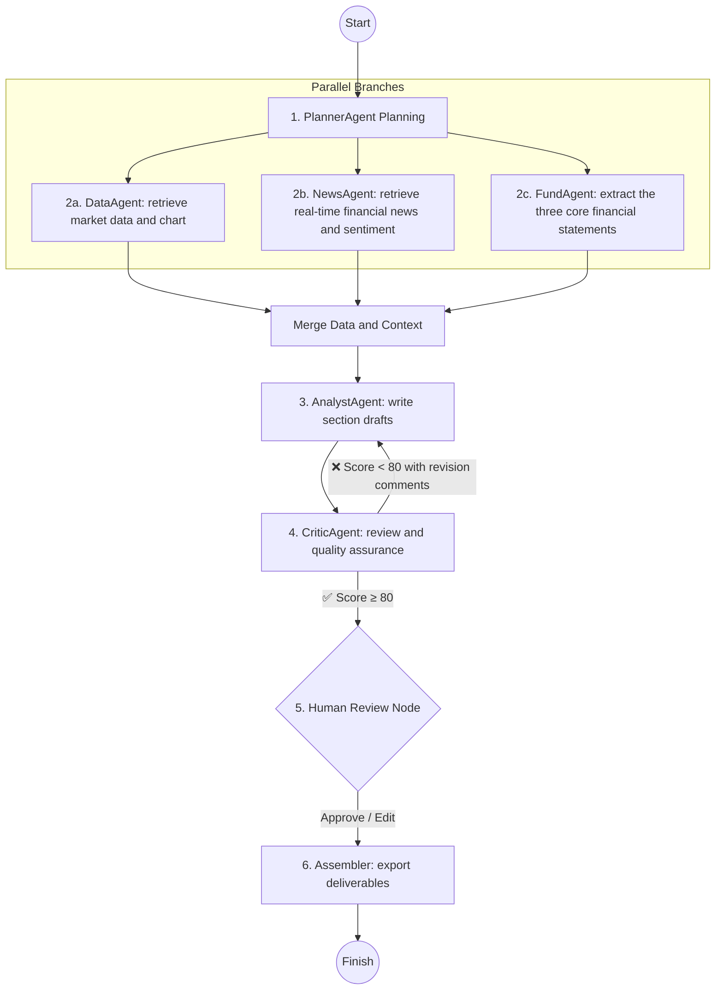

# Case 2: Multi-Agent Multimodal Financial Research Report System — User Guide

> **Module Positioning**: An enterprise-grade automated financial and securities research-report generation system built on the **classic Manager-Workers architecture + LangGraph StateGraph + multimodal data visualization + automated Python-Docx formatting**.

---

## 📖 Table of Contents
1. [System Architecture and In-Depth Multi-Agent Design](#1-system-architecture-and-in-depth-multi-agent-design)
   - [1.1 What Makes This a Multi-Agent System, and Why Not Use a Single Agent?](#11-what-makes-this-a-multi-agent-system-and-why-not-use-a-single-agent)
   - [1.2 Agent Roles and Responsibilities](#12-agent-roles-and-responsibilities)
2. [Project File Structure](#2-project-file-structure)
3. [Core Modules and Code Locations](#3-core-modules-and-code-locations)
   - [3.1 Model Factory — llm_factory.py](#31-model-factory--llm_factorypy)
   - [3.2 Agent Roles — agents_en.py](#32-agent-roles--agentspy)
   - [3.3 Deterministic Tooling Layer — tools_en.py](#33-deterministic-tooling-layer--toolspy)
   - [3.4 V1 Linear Orchestration — generator_en.py](#34-v1-linear-orchestration--generatorpy)
   - [3.5 V2 LangGraph StateGraph — generator_langgraph_en.py](#35-v2-langgraph-stategraph--generator_langgraphpy)
4. [Version Comparison: Classic Linear Orchestration vs. LangGraph StateGraph](#4-version-comparison-classic-linear-orchestration-vs-langgraph-stategraph)
   - [4.1 V1 vs. V2](#41-v1-vs-v2)
   - [4.2 Mapping LangGraph Concepts to the Research-Report System](#42-mapping-langgraph-concepts-to-the-research-report-system)
5. [Quick Start and Execution Steps](#5-quick-start-and-execution-steps)
6. [Core Deliverables and Formatting Standards](#6-core-deliverables-and-formatting-standards)
7. [Production-Grade Multi-Agent Extensions](#7-production-grade-multi-agent-extensions)
8. [Troubleshooting FAQ](#8-troubleshooting-faq)

---

## 1. System Architecture and In-Depth Multi-Agent Design

### 1.1 What Makes This a Multi-Agent System, and Why Not Use a Single Agent?

In a conventional single-prompt or single-agent solution, asking one model to perform a task such as "*plan a CATL research report, retrieve the previous 60 days of stock prices, generate a trend chart, write three sections, and export a professionally formatted Word document*" often creates serious bottlenecks:

```text
❌ Limitations of a single-agent approach:
[ Very long, overloaded prompt ] ──► [ One LLM ] ──► 🚨 Context contamination, uncontrolled tool use, logical omissions, formatting failures, and severe hallucination risk
```

This project uses a **multi-agent collaborative architecture** whose "multi" aspect is reflected in four core dimensions:

```text
✅ Advantages of the multi-agent collaboration model:
                 ┌──► [ 1. PlannerAgent ] ─────────── (LLM cognition: generate a structured outline JSON)
                 │
[ ResearchManager / ├──► [ 2. DataEngineerAgent ] ─── (Deterministic tools: time-series computation + Matplotlib charting)
  ReportState ]  │
                 ├──► [ 3. AnalystAgent ] ─────────── (LLM reasoning: write in-depth section analysis)
                 │
                 └──► [ 4. Assembler ] ────────────── (Deterministic program: python-docx text/image/table assembly)
```

1. **Single Responsibility Principle**
   - Each agent performs one clearly defined function. The Planner focuses on high-level structure, the Analyst focuses on detailed reasoning, and the Data Engineer focuses on accurate data and charts. This reduces the attention fragmentation that frequently occurs in complex, long-running single-agent tasks.

2. **Context Isolation**
   - Large volumes of time-series data generated during computation and charting are distilled by the Data Engineer into a compact statistical summary called `data_context`. Only this concise information is passed to the Analyst, preventing irrelevant raw data from overwhelming the Analyst's context window.

3. **Strict Decoupling of Cognition and Deterministic Computation**
   - **LLMs are strong at reasoning and language organization but comparatively weak at exact numerical computation and pixel-level chart rendering.**
   - The system therefore delegates deterministic operations such as percentage-change calculations, moving averages, and high-resolution Matplotlib rendering to Python code (`DataEngineerAgent` / `DataTools`). The LLM focuses on qualitative analysis, achieving 100% zero numerical hallucination.

4. **Structured Contracts and Defensive Programming**
   - Agents communicate through strict data contracts such as `ReportState` and JSON structures. If a model returns a slightly malformed result at one stage, defensive mechanisms can intercept the issue and adaptively recover, ensuring industrial-grade high availability across the workflow.

### 1.2 Agent Roles and Responsibilities

| Agent Role | Implementation | File                                                              | Core Technical Type | Responsibility and Operating Mechanism |
| :--- | :--- |:------------------------------------------------------------------| :--- | :--- |
| **Research Manager** | `ResearchManager` (V1)<br>`build_report_graph` (V2) | `generator_en.py` line 37<br>`generator_langgraph_en.py` line 143 | Control-flow orchestrator | Global workflow coordinator. Defines the report-generation pipeline, maintains shared state, distributes subtasks, and consolidates deliverables. |
| **Planner** | `PlannerAgent` | `agents_en.py` line 55                                            | Cognitive generation agent<br>(LLM-driven) | **High-level architect.** Acts as the chief editor of a financial research report and returns a strict JSON array containing three core section titles. |
| **Data Engineer** | `DataEngineerAgent` | `agents_en.py` line 103                                           | Functional execution agent<br>(deterministic-tool-driven) | **Data and chart executor.** Obtains 60-day time-series trading data through an adapter/tool layer, renders a high-resolution trend chart with Matplotlib, and packages key quantitative indicators. |
| **Financial Analyst** | `AnalystAgent` | `agents_en.py` line 151                                           | Detailed reasoning agent<br>(LLM-driven) | **Professional writer.** Receives section titles from the Planner and market context from the Data Engineer, then writes approximately 150 words of rigorous fundamental and technical analysis for each section. |
| **Assembler** | `_save_docx`<br>`_save_markdown` | `generator_en.py` lines 116 / 200                                 | Deterministic delivery engine | **Multimodal report assembler.** Uses `python-docx` to combine the outline, narrative sections, trend image, and recent trading-data table into polished Word and Markdown deliverables. |

---

## 2. Project File Structure

```text
case2_multi_agent_reporter/
├── User_Guide.md
├── Project_Practice_2_Start_Multi_Agent_Report_Generation.bat
├── Project_Practice_2_Advanced_Start_LangGraph_StateGraph_Report.bat
├── llm_factory.py
├── agents_en.py
├── generator_en.py
├── generator_langgraph_en.py
├── tools_en.py
├── requirements.txt
├── output_reports/
│   ├── CATL_300750_In-Depth_Research_Report.docx
│   └── CATL_300750_In-Depth_Research_Report.md
└── output_charts/
    └── 300750_trend.png
```

---

## 3. Core Modules and Code Locations

### 3.1 Model Factory — `llm_factory.py` (176 lines)

| Function / Class | Location | Description |
|:---|:---:|:---|
| Environment-variable loading | **lines 21-41** | Searches in the order `DOTENV_PATH` → local `.env` → `runtime/.env` → parent `.env`. |
| `MockLLM` | **line 55** | Instructional fallback that activates when both cloud access and local Ollama are unavailable; returns simulated responses according to prompt keywords. |
| `LLMFactory` | **line 96** | Main model-factory class responsible for model creation and connection failover. |
| `LLMFactory._init_llm()` | **line 112** | Implements the three-level fallback initialization strategy described below. |
| `LLMFactory.get_llm()` | **line 174** | Returns the currently available LLM instance. |

**Three-level fallback strategy** (`_init_llm()`, line 112 onward):

```text
┌─ Is SILICONFLOW_API_KEY available?
│    └─ ✅ ChatOpenAI(Qwen/Qwen3-8B, streaming=True)
│              └─ extra_body={"enable_thinking": False} disables thinking mode
│              └─ test_llm.invoke("hi") validates connectivity
│
├─ Try local Ollama
│    └─ ChatOllama(deepseek-r1:1.5b, keep_alive="5m")
│
└─ Fall back to MockLLM for offline instructional demonstration
```

**Key configuration sources**:
- `SILICONFLOW_API_KEY`: read from `.env`; not hard-coded
- `SILICONFLOW_BASE_URL`: defaults to `https://api.siliconflow.cn/v1`
- `ONLINE_LLM_MODEL`: defaults to `Qwen/Qwen3-8B`
- `LOCAL_LLM_MODEL_NAME`: defaults to `deepseek-r1:1.5b`
- `OLLAMA_BASE_URL`: defaults to `http://localhost:11434`

### 3.2 Agent Roles — `agents_en.py` (185 lines)

| Class / Method | Location | Description |
|:---|:---:|:---|
| `AgentBase` | **line 24** | Base class for all agents; encapsulates LLM invocation and generated-text cleanup. |
| `AgentBase._invoke_llm(prompt)` | **line 33** | Invokes the LLM, removes `<think>` content, and cleans abnormal repeated character streams. |
| `PlannerAgent` | **line 55** | Outputs a JSON list of three section titles; fallback: `["Market Review", "Technical Analysis", "Trading Recommendations"]`. |
| `PlannerAgent.run()` | **line 72** | Extracts a JSON array with a regular expression and falls back to the default outline if parsing fails. |
| `DataEngineerAgent` | **line 103** | Functional agent that invokes `DataTools` to obtain data and generate charts. |
| `DataEngineerAgent.run()` | **line 114** | Retrieves data, renders a trend chart, and packages the analysis context. |
| `AnalystAgent` | **line 151** | Receives a section title and market-data context and writes approximately 150 words of professional analysis. |
| `AnalystAgent.run()` | **line 172** | Removes accidentally generated Markdown headings and uses a fallback paragraph when generation returns empty content. |

**Key design details**:
- `AgentBase._invoke_llm`: `re.sub(r'<think>.*?</think>', '', ...)` removes model reasoning tags and keeps only the final generated text.
- `PlannerAgent`: `r'\[.*?\]'` extracts the JSON array and `json.loads` parses it, providing two layers of fault tolerance.
- `DataEngineerAgent`: runs deterministic Python logic and does not invoke an LLM.
- `AnalystAgent`: the prompt explicitly requires the model to use only supplied figures and prohibits fabricated data.

### 3.3 Deterministic Tooling Layer — `tools_en.py` (175 lines)

| Function | Location | Description |
|:---|:---:|:---|
| `DataTools.get_stock_data(symbol, stock_name, days)` | **line 43** | Generates a high-fidelity 60-day synthetic financial time series in the approximate CNY 97-115 range with Date/Open/High/Low/Close/Volume columns. |
| `DataTools.draw_chart(df, title, filename)` | **line 107** | Uses Matplotlib to render the closing-price line plus MA5/MA20 moving averages and saves the result to `output_charts/`. |

**Key design details**:
- `get_stock_data`, line 64: `np.random.seed(42)` fixes the random seed so every run generates the same trend.
- Lines 81-84 normalize the data to the target range and set the final close to CNY 97.33 to align with the teaching example.
- `draw_chart`, line 126: `figsize=(10, 5), dpi=150` produces a high-resolution output.
- Starting around line 148, MA5 and MA20 moving-average reference lines are added.
- The Matplotlib font configuration uses a fallback chain: `Microsoft YaHei` → `SimHei` → `Arial Unicode MS` → `DejaVu Sans`.

### 3.4 V1 Linear Orchestration — `generator_en.py` (247 lines)

| Function / Class | Location | Description |
|:---|:---:|:---|
| `ResearchManager` | **line 37** | Project-level orchestrator that coordinates four stages. |
| `generate_report(stock_name, stock_code)` | **line 52** | One-call entry point that executes Stages 1-4 sequentially. |
| Stage 1: Outline Planning | **around line 68** | Calls `PlannerAgent.run()` to generate section titles. |
| Stage 2: Data Extraction and Charting | **around line 79** | Calls `DataEngineerAgent.run()` to obtain the data package. |
| Stage 3: Section Writing | **around line 89** | Iterates through sections and calls `AnalystAgent.run()` sequentially. |
| Stage 4: Multimodal Assembly | **around line 105** | Calls `_save_docx` and `_save_markdown` to generate deliverables. |
| `_save_docx()` | **line 116** | Uses python-docx to assemble a Word report containing a trend chart and trading-data table. |
| `_save_docx` font setup | **around line 142** | Sets `Microsoft YaHei` as the document font and East Asian font fallback. |
| `_save_docx` chart insertion | **around line 160** | Inserts `300750_trend.png` at a width of 6.0 inches and centers it. |
| `_save_docx` analysis sections | **around line 169** | Adds each section as Heading 1 followed by its analysis paragraph. |
| `_save_docx` trading-data table | **around lines 176-196** | Adds a four-column Date / Close / High / Volume table. |
| `_save_markdown()` | **line 200** | Saves a Markdown copy for browser or GitHub preview. |

**V1 execution flow**:

```text
generate_report("CATL", "300750")
  ├─ Stage 1: PlannerAgent.run()           → 3 section titles
  ├─ Stage 2: DataEngineerAgent.run()      → data package + trend chart
  ├─ Stage 3: AnalystAgent.run() in a loop → section-by-section writing (sequential)
  └─ Stage 4: _save_docx + _save_markdown → Word + Markdown deliverables
```

### 3.5 V2 LangGraph StateGraph — `generator_langgraph_en.py` (208 lines)

| Function / Node | Location | Description |
|:---|:---:|:---|
| `ReportState(TypedDict)` | **line 36** | Strongly typed definition of the seven-field global shared state. |
| `planner_node(state)` | **line 53** | Node 1: Planner; updates the `sections` field. |
| `data_engineer_node(state)` | **line 64** | Node 2: Data Engineer; updates the `data_packet` field. |
| `analyst_node(state)` | **line 78** | Node 3: Analyst; writes sections **in parallel** and updates `word_sections`. |
| `assembler_node(state)` | **line 118** | Node 4: Assembler; updates `docx_path` and `md_path`. |
| `build_report_graph()` | **line 143** | Builds the LangGraph StateGraph by registering nodes, connecting edges, and compiling the graph. |
| `run_langgraph_workflow(stock_name, stock_code)` | **line 178** | Execution entry point: initializes state, builds the graph, and calls `graph.invoke()`. |

**V2 graph topology**:

```text
set_entry_point("planner")
  └─► planner_node ──► data_engineer_node ──► analyst_node ──► assembler_node ──► END
      (line 53)       (line 64)              (line 78)       (line 118)
```

**Parallel execution details**:
- Around line 89: `ThreadPoolExecutor(max_workers=len(sections))` creates the worker pool.
- One task is submitted for each section title.
- Around line 102: `as_completed` collects results as API calls complete.
- Result: generating three sections is reduced from approximately 2 minutes sequentially to approximately 22 seconds, for roughly a 5× speedup.

**Key design details**:
- `ReportState` provides a strict seven-field typed state definition for IDE support and clearer data flow.
- Each node returns a partial state update such as `{"sections": sections}` instead of replacing the entire state.
- `analyst_node` reads the compact `data_context` from `data_packet`.
- `assembler_node` reuses `ResearchManager._save_docx` and `_save_markdown` from `generator_en.py`.

---

## 4. Version Comparison: Classic Linear Orchestration vs. LangGraph StateGraph

The project provides both a **basic version (`generator_en.py`)** and an **advanced version (`generator_langgraph_en.py`)**, allowing learners to progress from a straightforward sequential workflow to an industrial graph-based state-management model.

### 4.1 V1 vs. V2

```mermaid
graph TD
    subgraph V1 Classic Linear Orchestration (Process-Driven)
        A1[ResearchManager] -->|1. Invoke| B1[Planner]
        A1 -->|2. Invoke| C1[DataEngineer]
        A1 -->|3. Repeatedly invoke| D1[Analyst]
        A1 -->|4. Invoke| E1[DocxAssembler]
    end

    subgraph V2 LangGraph StateGraph (StateGraph-Driven)
        S[(Global ReportState Shared State Board)]
        N1[Planner Node] -->|Update sections| S
        S --> N2[DataEngineer Node]
        N2 -->|Update data_packet / chart| S
        S --> N3[Analyst Node]
        N3 -->|Update word_sections| S
        S --> N4[Assembler Node]
        N4 -->|Update docx_path / md_path| S
        N4 --> END((END))
    end
```

| Comparison Dimension | V1 Basic (`generator_en.py`) | V2 Advanced (`generator_langgraph_en.py`)                                                                                                                |
| :--- |:----------------------------------------------------------------------------------------------------------------------------|:---------------------------------------------------------------------------------------------------------------------------------------------------------|
| **Orchestration Model** | **Process-driven**: the Manager explicitly invokes each Agent through hard-coded Python control flow.                       | **State-driven**: nodes read and update the shared `ReportState` through a directed graph and state-machine abstraction.                                 |
| **Control-Flow Topology** | Strictly linear and less flexible for complex branching, retry loops, or state rollback.                                    | Declarative graph topology with native support for conditional edges, loops, and dynamic routing.                                                        |
| **State Management** | State is passed through local variables and function parameters, increasing coupling as more agents are added.              | A global strongly typed `ReportState` (`TypedDict`, line 36) provides a clear data schema and explicit shared-state model.                               |
| **Observability and Persistence** | Requires intrusive additions of extensive print/log statements and cannot pause or resume at an intermediate state.         | Natively supports **Checkpointer** functionality, including state-snapshot persistence, checkpoint recovery, and Time-Travel debugging.                  |
| **Human-in-the-Loop (HITL)** | It is difficult to pause the main thread cleanly and wait for manual intervention.                                          | Natively supports `interrupt_before` / `interrupt_after`, allowing the workflow to pause at any node for user review before continuing.                  |
| **Section Execution** | Sequential: the API is called for three sections one after another (approximately 2 minutes).                               | **Parallel**: API requests for all three sections are issued concurrently (approximately 22 seconds).                                                    |
| **Learning Curve** | Very accessible; learners only need basic Python object-oriented programming knowledge to understand the agent-role design. | Aligned with 2025/2026 industry Multi-Agent architecture patterns and suitable for advanced learners moving toward enterprise-grade agent-system design. |

### 4.2 Mapping LangGraph Concepts to the Research-Report System

| LangGraph Concept | Code Location | Mapping in This System |
| :--- | :--- | :--- |
| `StateGraph(ReportState)` | `generator_langgraph.py`, around line 154 | Defines the global graph and the data contract carried through the workflow. |
| `add_node(name, fn)` | around line 158 | Registers each agent function as a graph node that receives state and returns a partial update. |
| `set_entry_point("planner")` | line 164 | Specifies the Planner as the workflow entry node. |
| `add_edge(node_a, node_b)` | lines 165-168 | Explicitly defines data-flow and execution dependencies between nodes. |
| `compile()` | line 171 | Compiles the graph into an executable runnable application. |
| `graph.invoke(initial_state)` | line 195 | Executes the StateGraph and returns the final state dictionary. |

---

## 5. Quick Start and Execution Steps

### 1. Environment Preparation

Ensure the portable `runtime/` Python environment is available. In the original teaching environment it is approximately 1.4 GB and contains the required dependencies.

### 2. Run the Basic Version (V1 — Manager Linear Orchestration)

- **Option 1: Double-click launcher**: In the `case2_multi_agent_reporter/` directory, double-click `Project_Practice_2_Start_Multi_Agent_Report_Generation.bat`.
- **Option 2: Command line**:
  ```bash
  cd case2_multi_agent_reporter
  ..\runtime\Scripts\python.exe generator_en.py
  ```

### 3. Run the Advanced Version (V2 — LangGraph StateGraph Engine)

- **Option 1: Double-click launcher**: In the `case2_multi_agent_reporter/` directory, double-click `Project_Practice_2_Advanced_Start_LangGraph_StateGraph_Report.bat`.
- **Option 2: Command line**:
  ```bash
  cd case2_multi_agent_reporter
  ..\runtime\Scripts\python.exe generator_langgraph_en.py
  ```

### 4. Review Generated Reports and Charts

- Report output directory: `case2_multi_agent_reporter/output_reports/`
  - `CATL_300750_In-Depth_Research_Report.docx` — professionally formatted Word document with text and chart content
  - `CATL_300750_In-Depth_Research_Report.md` — Markdown text-preview version
- Chart output directory: `case2_multi_agent_reporter/output_charts/`
  - `300750_trend.png` — high-resolution price-trend and moving-average chart rendered with Matplotlib

---

## 6. Core Deliverables and Formatting Standards

To achieve a level suitable for professional brokerage or investment-research workflows, the assembly module follows a structured report layout:

```text
┌──────────────────────────────────────────────────────────────────────────┐
│  📑 CATL (300750) In-Depth Investment Research Report                   │  <- Main title (22 pt, centered)
│  Report Date: 2026-08-18 | Engine: AI Multi-Agent                       │  <- Subtitle (10.5 pt, centered)
├──────────────────────────────────────────────────────────────────────────┤
│  1. Core Price Trend                                                     │  <- Section heading (14 pt, bold)
│  [ Insert high-resolution 300750_trend.png, centered, 6.0 in wide ]     │
├──────────────────────────────────────────────────────────────────────────┤
│  2. Recent Core Trading Indicators                                       │
│  ┌────────────┬──────────────┬──────────────┬────────────────┐           │
│  │ Date       │ Close (CNY)  │ High (CNY)   │ Volume (lots)  │           │
│  ├────────────┼──────────────┼──────────────┼────────────────┤           │
│  │ 2026-08    │ 97.33        │ 116.44       │ 125,000        │           │
│  └────────────┴──────────────┴──────────────┴────────────────┘           │
├──────────────────────────────────────────────────────────────────────────┤
│  3. Industry Background and Market Position                              │
│  [Body paragraph] Recent market performance and price-volume dynamics... │
│                                                                          │
│  4. In-Depth Financial and Technical Trend Analysis                       │
│  [Body paragraph] Based on moving averages and market structure...       │
│                                                                          │
│  5. Investment Recommendations and Risk Considerations                    │
│  [Body paragraph] Maintain a constructive view while monitoring risk...  │
└──────────────────────────────────────────────────────────────────────────┘
```

---

## 7. Production-Grade Multi-Agent Extensions

Based on the current architecture, a production-grade financial-research implementation could evolve in five major directions:



1. **Introduce a Critic / Reviewer Agent Loop**
   - Add a `CriticAgent` after `AnalystAgent` to perform fact checking, compliance review, and logical scoring. If the score is below the acceptance threshold, use a LangGraph **Conditional Edge** to route the state back to the Analyst for revision, creating a self-correcting loop.

2. **Asynchronous Parallel Branches / Map-Reduce**
   - Use LangGraph-native concurrency to run data charting, financial-news retrieval (for example, SerpAPI/Tavily), and financial-statement analysis in parallel. Multiple analysts could also write different report sections concurrently, reducing generation time from 30 seconds to under 5 seconds. This project already implements section-level parallelism in `AnalystNode`.

3. **Dynamic Tool Calling with ReAct**
   - Upgrade the workflow to autonomous agents connected to financial-data APIs such as AkShare or Tushare. The LLM can then decide when to query valuation multiples, consensus research expectations, or block-trading data.

4. **Human-in-the-Loop Collaboration**
   - Use a mechanism such as `interrupt_before=["assembler"]` to pause before Word export, present the generated outline and paragraphs in a web interface, and allow an investment-research director to review or edit the content before resuming.

5. **Agentic RAG for Hybrid Research**
   - Combine the vector knowledge base from Case 1 with the multi-agent workflow from Case 2. While drafting each section, the Analyst can retrieve relevant evidence from a vector index built from the listed company's historical annual-report PDFs, enabling dual-source reasoning based on both quantitative market data and research-document retrieval.

---

## 8. Troubleshooting FAQ

### Q1: The log shows `langchain-openai detected system proxy configuration...`. Is this an error?

**Answer**: No. It is an informational system-adaptation message. It indicates that a network proxy was detected and that the underlying LangChain/OpenAI client is adapting its networking behavior. By itself, this message does not indicate a generation failure.

### Q2: Why is the generated content sometimes relatively short?

**Answer**: The instructional configuration uses `max_tokens=400` together with concise prompts to keep generation fast. For longer reports, increase `max_tokens` in `llm_factory.py` (for example, to `2048`) and specify a more detailed output-length requirement in the `AnalystAgent` prompt in `agents_en.py`.

### Q3: How do I change the stock being analyzed?

**Answer**: Change the arguments in the `__main__` entry point:
- V1: `generator_en.py`, line 247: `manager.generate_report(stock_name="CATL", stock_code="300750")`
- V2: `generator_langgraph_en.py`, line 208: `run_langgraph_workflow("CATL", "300750")`

### Q4: Do V1 and V2 generate different report content?

**Answer**: They use the same core Planner → DataEngineer → Analyst → Assembler workflow. The main difference is orchestration: V1 uses a sequential Python Manager workflow, while V2 uses a LangGraph StateGraph and performs section writing in parallel. Both versions save report files to `output_reports/`.

### Q5: What should I do if I see `ImportError: No module named 'langgraph'`?

**Answer**: The runtime does not currently have `langgraph` installed. The advanced V2 workflow is designed to fall back to the standard V1 `ResearchManager` path when `build_report_graph()` cannot import LangGraph. You can also install the missing package with `pip install langgraph`.

### Q6: Is the trend-chart data real historical market data?

**Answer**: No. `tools_en.py` uses `np.random` with a fixed seed to generate high-fidelity synthetic data for instructional demonstration. The trend shape and approximate CNY 97-115 range are designed to resemble the teaching example rather than represent actual historical CATL market prices. For real data, replace `DataTools.get_stock_data()` with a real market-data source such as AkShare or Tushare.

### Q7: How is Qwen3 thinking mode disabled?

**Answer**: `enable_thinking=False` is passed through `extra_body` in `llm_factory.py`. To enable thinking mode, remove the corresponding `extra_body` setting in `llm_factory.py` and the corresponding location in `generator_langgraph_en.py`. Note that enabling the thinking chain can increase inference time from approximately 1.8 seconds to approximately 72 seconds.

### Q8: How does the system reduce the risk of Analyst-generated numerical fabrication?

**Answer**: The `AnalystAgent` prompt includes the constraint "strictly cite the actual figures provided in the data context and do not fabricate any data." At the same time, the data are calculated by deterministic Python code in `DataEngineerAgent`; the LLM is responsible only for language refinement and does not participate in numerical computation.

### Q9: Is the order of parallel section generation random?

**Answer**: `analyst_node` uses `as_completed` to collect results, so completion order depends on API response speed. However, the final section order in the `word_sections` list does not affect Word-document formatting because `_save_docx` outputs sections in list order.
